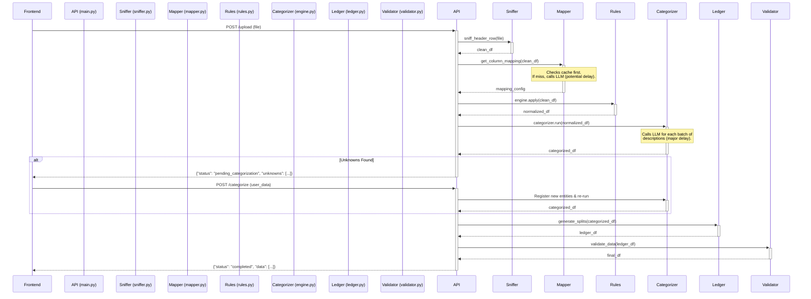

# RosettaFi Technical Architecture & Flow

This document provides a detailed technical breakdown of the RosettaFi processing pipeline, with a focus on the data flow, component interactions, and performance considerations.

## High-Level End-to-End Flow

The entire process is initiated by a single file upload. The backend then runs a sequential pipeline of stages to process the data. The two points of significant time consumption are the initial **Mapper** (if the file format is new) and the **Categorizer**, which processes transaction descriptions.



---

## Detailed Stage Breakdown

### 1. Stage: Sniffer
- **Files**: `rosetta/sniffer.py`
- **Purpose**: To ingest a raw file (CSV, TXT, XLS) and reliably find the header row, ignoring metadata and blank lines.
- **Process**:
    1.  If the file is an Excel file, it's first converted into an in-memory CSV representation.
    2.  It uses a **Data Density Heuristic**. Each row is scored based on the "fullness" of its cells.
    3.  A sudden change in density (e.g., from sparse metadata to dense data) indicates the start of the data. The row just before this transition is marked as the header.
- **Performance**: Very fast. This is pure Python logic operating on file contents. No LLM calls.

### 2. Stage: Mapper
- **Files**: `rosetta/mapper.py`, `rosetta/data/constants.py`
- **Purpose**: To map the columns from the source file to the standardized RosettaFi schema (`date`, `amount`, `description`, etc.).
- **Process**:
    ```mermaid
    flowchart TD
        A[get_column_mapping] --> B{Header Hash in Cache?};
        B -- Yes --> C[Load from bank_configs.json];
        B -- No --> D{Attempt LLM Mapping};
        D -- Success --> E[Return LLM-generated Mapping];
        D -- Failure --> F[Use Heuristic Fallback];
        F --> G[Return Heuristically-generated Mapping];
        E --> H{Save Mapping to Cache};
        G --> H;
        C --> Z[Return Cached Mapping];
        H --> Z;
    ```
- **Performance**:
    - **Cache Hit (Fast)**: If the file's header structure has been seen before, the mapping is loaded instantly from `~/.rosetta_cache/configs/bank_configs.json`.
    - **Cache Miss (Potentially Slow)**: If the file format is new, the system makes a **single LLM call** (`_get_llm_mapping`) to `ollama` to determine the mapping. This introduces a noticeable, one-time delay for each new file type. If the LLM fails, a fast Python-based heuristic is used as a fallback.

### 3. Stage: Rules Engine
- **Files**: `rosetta/rules.py`
- **Purpose**: To clean and normalize the data based on the mapping configuration.
- **Process**:
    1.  **Strategy Selection**: Selects a parsing strategy (e.g., `EUParsingStrategy` for comma-decimals) based on the `mapper` output.
    2.  **Column Renaming**: Renames the original columns (e.g., `Transactiedatum`, `Omschrijving`) to the standard names (`date`, `description`). **This is a key step.**
    3.  **Data Cleaning**: Normalizes date formats, cleans amount fields (removing currency symbols), and handles transaction polarity (e.g., converting credit/debit columns into a single signed `amount` column).
- **Performance**: Very fast. This is all pure Python and pandas logic.

### 4. Stage: Categorization Engine
- **Files**: `rosetta/logic/categorization/*`
- **Purpose**: To assign a clean entity name (e.g., "Starbucks") and a category (e.g., "Food & Drink") to each transaction.
- **Process**: This is the most complex and time-consuming stage. It runs in three passes.
    ```mermaid
    sequenceDiagram
        participant main.py
        participant C_Engine as CategorizationEngine
        participant Segmenter as LLMSegmenter
        participant Resolver as EntityResolver
        participant P_Book as Phonebook

        main.py->>+C_Engine: run(df, "description")
        C_Engine->>+Segmenter: tokenize_batch(descriptions)
        Note over Segmenter: For every batch (e.g., 5 rows),<br/>makes one API call to the LLM.
        Segmenter-->>-C_Engine: clean_tokens
        C_Engine->>C_Engine: df['merchant_clean'] = clean_tokens
        C_Engine->>+Resolver: resolve(merchant_clean)
        Resolver->>+P_Book: find_entity_by_alias(token)
        P_Book-->>-Resolver: Found / Not Found
        Resolver-->>-C_Engine: entity
        C_Engine->>C_Engine: df['Entity'] = entity.canonical_name<br/>df['Category'] = entity.default_category
        C_Engine-->>-main.py: categorized_df
    ```
- **Performance Bottleneck**:
    - **Pass 1: Tokenization (The Shredder)**: The `LLMSegmenter.tokenize_batch` method is called for the entire dataframe.
    - Inside this method, the descriptions are grouped into small batches (e.g., `BATCH_SIZE = 5`).
    - **For each small batch, a separate call is made to the LLM (`qwen2.5:7b`)**.
    - If you upload a file with 242 transactions, this results in approximately **49 separate LLM calls** (`242 / 5`). This is the primary source of the long delay. The purpose of this step is to use the LLM to remove junk and extract the core merchant name from the raw description string.
    - **Pass 2 & 3 (Resolution & Categorization)**: These are very fast. They use the in-memory `Phonebook` for lookups (exact and fuzzy string matching), which does not involve any LLM calls.

### 5 & 6. Stages: Ledger & Validator
- **Files**: `rosetta/logic/ledger.py`, `rosetta/validator.py`
- **Purpose**:
    - **Ledger**: To convert the single-line transactions into a double-entry accounting format.
    - **Validator**: To enforce a strict data schema on the final output using `pandera`.
- **Performance**: Very fast. Pure Python and pandas logic.

---

## Summary of Performance Issues

The "slowness" of the library is almost entirely concentrated in **Stage 4: Categorization**, specifically in the "Pass 1: Tokenization" step.

- **Problem**: The system makes one LLM API call for every ~5 transactions to clean up the description field.
- **Example**: A 500-row file will trigger ~100 LLM calls, leading to a significant wait time.

### Potential Optimizations

1.  **Make LLM Cleaning Optional**: Add a parameter to `CategorizationEngine.run()` to skip the `_tokenize_df` step. The resolver can then work directly on the raw `description` field. This would be much faster but might lead to slightly less accurate entity matching.
2.  **Implement Caching for Tokenization**: Before calling the LLM segmenter for a description, check an in-memory or on-disk cache. If that exact description has been tokenized before, use the cached result. This would significantly speed up re-processing of the same or similar files.
3.  **Increase Batch Size**: A larger `BATCH_SIZE` in `LLMSegmenter` would reduce the *number* of API calls, but each call would take longer. This requires experimentation to find the optimal balance.
4.  **Use a Simpler, Non-LLM Cleaner**: Replace the `LLMSegmenter` with a simpler Python function that uses regular expressions and blocklists to clean the description string. This would be a major performance boost at the cost of the "intelligence" of the LLM.

This analysis should provide a clear path forward for addressing the performance issues.
